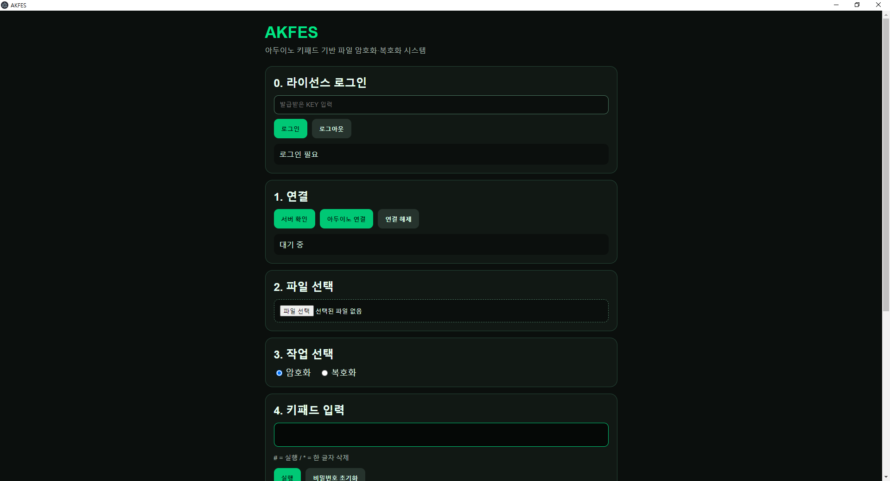
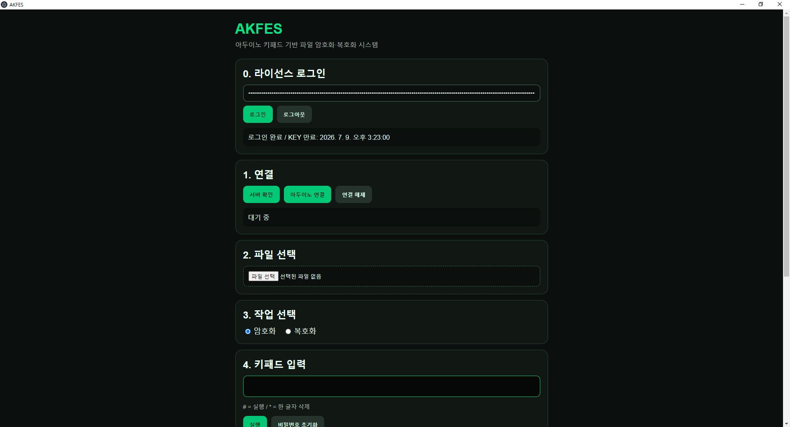

# AKFES


**Arduino Keypad-Based File Encryption System**

*A tiny file security project with an Arduino keypad, an Electron app, AES-GCM encryption, license keys, and just enough paranoia to make it interesting.*

---

## What is AKFES?

**AKFES** is a file encryption and decryption system that uses an **Arduino keypad** as a physical password input device.

Instead of typing your password on a regular keyboard like a normal person, AKFES lets you enter it through a hardware keypad connected to an Arduino. The Electron client sends the file and password to the server, and the server handles license verification, encryption, and decryption.

Because apparently clicking “Encrypt” was not dramatic enough.

---

## Screenshots

### Desktop Client



AKFES runs as an Electron desktop client with a dark security-dashboard style interface.

### License Login



Users must log in with a time-limited license key before using file encryption or decryption.

### Arduino Keypad Device


The Arduino keypad is used as a physical password input device.
A green LED indicates success, while a red LED indicates failure.

### Encryption Result


After processing, AKFES automatically downloads the encrypted or decrypted file.

---

## System Architecture


AKFES separates the client and server.

The **Electron client** handles the user interface, Arduino connection, file selection, and password input.
The **Flask server** handles license verification, session validation, file encryption, file decryption, and forensic-style logging.

---

## Hardware Wiring


Default wiring:

```text
Keypad 8 wires → Arduino D2 ~ D9
Green LED      → D10
Red LED        → D11
GND            → Breadboard GND rail
```

LED wiring:

```text
D10 → resistor → green LED long leg (+)
green LED short leg (-) → GND

D11 → resistor → red LED long leg (+)
red LED short leg (-) → GND
```

Use a **220Ω ~ 330Ω resistor**.

Do not connect LEDs directly unless you want to convert electronics into tiny sadness.

---

## Features

* Arduino keypad-based password input
* Electron desktop client
* Separated client and server architecture
* License key login system
* Time-limited license keys
* Session-token-based requests
* AES-256-GCM file encryption
* PBKDF2-HMAC-SHA256 key derivation
* HMAC-SHA256 license key signing
* HMAC-SHA256 session token signing
* Works with all file extensions
* Keeps Korean filenames intact
* Adds `[암호화됨]` and `[복호화됨]` to filenames
* Green LED on success
* Red LED on failure
* Server-side rate limiting
* Revoked license key list
* Basic forensic logging
* Contact links for Telegram, GitHub, and Instagram
* JavaScript obfuscation support

---

## Release

The latest packaged version of AKFES can be downloaded from the **Releases** page.

### Latest Version

**v1.0.0 — AKFES Clean Release**

This release includes:

* Electron desktop client
* Separated server and client structure
* Arduino keypad password input
* License key authentication
* Time-limited license keys
* AES-GCM file encryption and decryption
* PBKDF2 key derivation
* Green / red LED result indicators
* Server-side rate limiting
* Revoked license key support
* Basic forensic logging
* Contact link configuration
* Cleaned project structure with unused files removed

### Download

Go to the GitHub **Releases** page and download the latest ZIP file:

```text
akfes_clean_no_comments.zip
```

After downloading, extract the ZIP file before running the project.

### Version History

| Version | Description                                                                                                                                 |
| ------- | ------------------------------------------------------------------------------------------------------------------------------------------- |
| v1.0.0  | First clean release with Electron client, separated server, license keys, Arduino keypad input, AES-GCM encryption, and cleaned source code |

---

## Project Structure

```text
AKFES
├─ assets
│  ├─ screenshots
│  │  ├─ dashboard.png
│  │  ├─ license-login.png
│  │  ├─ arduino-keypad.jpg
│  │  └─ encryption-result.png
│  └─ diagrams
│     ├─ architecture.png
│     └─ wiring-diagram.png
│
├─ AKFES-Server
│  ├─ server
│  │  ├─ server.py
│  │  └─ requirements.txt
│  ├─ tools
│  │  └─ generate_license_key.py
│  ├─ START_SERVER.bat
│  ├─ GENERATE_KEY.bat
│  ├─ GENERATE_KEY_QUICK.bat
│  └─ revoked_keys.json
│
├─ AKFES-Client
│  ├─ electron
│  │  ├─ main.js
│  │  ├─ preload.js
│  │  ├─ use-obfuscated.js
│  │  └─ use-original.js
│  ├─ client
│  │  ├─ templates
│  │  │  └─ index.html
│  │  └─ static
│  │     ├─ app.js
│  │     ├─ contact_config.js
│  │     ├─ style.css
│  │     └─ images
│  ├─ arduino
│  │  └─ project.ino
│  └─ START_ELECTRON_DEV.bat
│
├─ START_AKFES_ALL.bat
├─ START_AKFES_DEMO.bat
├─ GENERATE_DEMO_KEY.bat
└─ README.md
```

---

## How It Works

```text
1. Admin generates a time-limited license key.
2. User opens the Electron client.
3. User logs in with the license key.
4. Server verifies the license key signature and expiration time.
5. Server issues a session token.
6. User selects a file.
7. User enters a password using the Arduino keypad.
8. Client sends the file, password, and session token to the server.
9. Server encrypts or decrypts the file.
10. User downloads the result.
11. Green LED means success.
12. Red LED means something went wrong. Probably your fault. Probably.
```

---

## Tech Stack

### Client

* HTML
* CSS
* JavaScript
* Electron
* Web Serial API

### Server

* Python
* Flask
* Flask-CORS
* Flask-Limiter
* cryptography

### Hardware

* Arduino Uno
* 4x4 keypad
* Green LED
* Red LED
* MB102 breadboard
* Wires, patience, and at least one moment of regret

---

## Cryptography Design

AKFES uses three main cryptographic mechanisms:

```text
File encryption:        AES-256-GCM
Password key derivation: PBKDF2-HMAC-SHA256
License/session signing: HMAC-SHA256
```

### 1. File Encryption: AES-256-GCM

AKFES uses **AES-GCM** for file encryption and decryption.

AES is a symmetric encryption algorithm, which means the same key is used for encryption and decryption.
GCM mode provides both:

* **Confidentiality** — hides the file contents
* **Integrity** — detects whether the encrypted file has been modified or corrupted

So if someone changes even a tiny part of the encrypted file, decryption will fail.

That is not a bug.
That is the algorithm doing its job.

### 2. Password-Based Key Derivation: PBKDF2-HMAC-SHA256

The password entered through the Arduino keypad is **not used directly** as the AES key.

Instead, AKFES uses **PBKDF2-HMAC-SHA256** to derive a 32-byte encryption key.

```text
User password
↓
Random salt
↓
PBKDF2-HMAC-SHA256, 200,000 iterations
↓
32-byte AES key
↓
AES-256-GCM encryption
```

Current settings:

```text
Salt size:        16 bytes
Nonce size:       12 bytes
AES key size:     32 bytes
PBKDF2 rounds:    200,000 iterations
```

Since 32 bytes equals 256 bits, AKFES effectively uses **AES-256-GCM**.

### 3. Encrypted File Format

Encrypted files are stored in this format:

```text
salt 16 bytes + nonce 12 bytes + ciphertext
```

There is no obvious magic header like:

```text
HELLO_I_AM_ENCRYPTED_WITH_THIS_LIBRARY
```

because that would be rude to security.

This does not replace real security, but it avoids casually exposing the encryption format.

### 4. License Key Signing: HMAC-SHA256

AKFES license keys are signed using **HMAC-SHA256**.

The license key format is roughly:

```text
HCK1.payload.signature
```

The payload contains information such as:

```text
license ID
name
issued time
expiration time
scope
```

The server verifies the signature using `LICENSE_SECRET`.

If someone modifies the expiration time or payload, the signature no longer matches, and the server rejects the key.

Nice try, imaginary attacker.

### 5. Session Token Signing: HMAC-SHA256

After a valid license key is accepted, the server issues a session token.

The session token format is roughly:

```text
HCS1.payload.signature
```

The server checks:

```text
Is the token signed correctly?
Is it expired?
Is it intended for AKFES?
Does it have the file_crypto scope?
Is the license revoked?
```

Only valid sessions can use the file processing API.

---

## Filename Rules

Example:

```text
photo.png → photo[암호화됨].png
photo[암호화됨].png → photo[복호화됨].png
```

Yes, it supports Korean filenames.
Yes, that was intentional.
Yes, encoding bugs were harmed during development.

---

## Running the Server

Set environment variables first:

```bat
set LICENSE_SECRET=your_long_random_license_secret
set SESSION_SECRET=your_long_random_session_secret
```

Then start the server:

```bat
cd AKFES-Server
START_SERVER.bat
```

By default, the server runs at:

```text
http://127.0.0.1:5000
```

For real deployment, please use HTTPS.

Sending keys, tokens, files, and passwords over plain HTTP is how horror stories begin.

---

## Running the Client

```bat
cd AKFES-Client
set AKFES_SERVER_URL=http://127.0.0.1:5000
START_ELECTRON_DEV.bat
```

The Electron app will open, and you can log in with a license key, connect your Arduino, choose a file, and encrypt or decrypt it.

---

## One-Click Development Launch

For local development or demonstration:

```text
START_AKFES_ALL.bat
```

This starts both the server and the Electron client.

---

## Demo Mode

For quick testing:

```text
START_AKFES_DEMO.bat
```

Demo mode uses fixed demo secrets.

Do not use demo secrets in production unless you enjoy being the main character in your own incident report.

---

## Generating a Demo License Key

```text
GENERATE_DEMO_KEY.bat
```

Or manually:

```bat
cd AKFES-Server
set LICENSE_SECRET=your_long_random_license_secret
GENERATE_KEY_QUICK.bat 1d demo
```

Lifetime examples:

```text
3h = 3 hours
1d = 1 day
2w = 2 weeks
3m = 3 months
1y = 1 year
```

---

## Contact Links

Edit this file:

```text
AKFES-Client/client/static/contact_config.js
```

Example:

```javascript
window.AKFES_CONTACTS = {
    telegram: "https://t.me/your_telegram_id",
    github: "https://github.com/Smarttiger2338",
    instagram: "https://instagram.com/your_instagram_id"
};
```

---

## JavaScript Obfuscation

To obfuscate the client JavaScript:

```bash
cd AKFES-Client
npm install
npm run obfuscate
npm run use-obfuscated
```

To switch back to the original file:

```bash
npm run use-original
```

Obfuscation makes analysis harder, not impossible.
Think of it as locking your diary, not building Fort Knox.

---

## Forensic Logging

The server can log events such as:

* Successful login
* Failed login
* Revoked key usage
* Successful file processing
* Failed file processing
* Request IP address
* Error timestamps

These logs can be useful for basic forensic analysis.

Do not log:

```text
passwords
full session tokens
full license keys
file contents
```

Future-you will thank present-you.

---

## Security Notes

AKFES includes:

* Client/server separation
* License key verification
* Session token validation
* License expiration checks
* Revoked license key support
* Rate limiting
* AES-GCM authenticated encryption
* PBKDF2-HMAC-SHA256 key derivation
* HMAC-SHA256 signing
* Simplified server error messages
* Login and file-processing logs
* JavaScript obfuscation support

However:

* Obfuscation is not real security.
* Client-side code can always be inspected eventually.
* Server secrets must never be shipped to users.
* Production deployments should use HTTPS.
* Do not log passwords, full tokens, full license keys, or file contents.

Security is not a button.
Unfortunately.

---

## Deployment Warning

Do not upload real secrets to GitHub.

Never commit:

```text
LICENSE_SECRET
SESSION_SECRET
real license keys
user data
private server configuration
```

For real deployment, users should receive only the client application.
The server, license key generator, and signing secrets should remain under the operator’s control.

---

## Why This Project Exists

AKFES started as a file encryption project and slowly evolved into a small security system involving:

* IoT-style hardware input
* Server-side authentication
* License-based access control
* Electron desktop UI
* Forensic logging
* LEDs that judge your success or failure

It is a learning project for exploring file security, hardware interaction, and practical security architecture.

---

## Disclaimer

This project is built for learning, experimentation, and portfolio purposes.

Before using anything like this in production, you should add:

* HTTPS
* proper server deployment
* stronger key management
* secure logging
* user privacy controls
* backup and recovery planning
* threat modeling
* probably coffee

---

## License

This project is for educational and research purposes.

Use responsibly.
Encrypt wisely.
Do not anger the Arduino.
